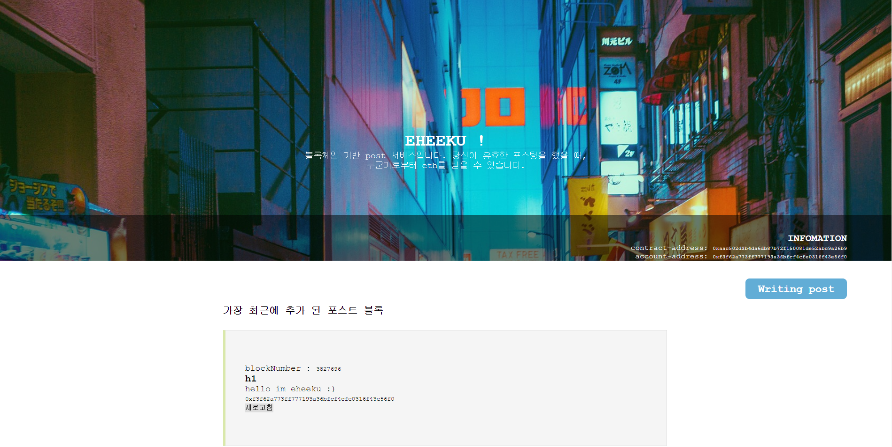
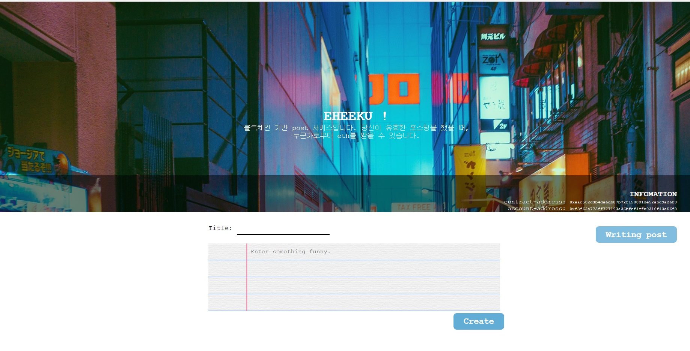
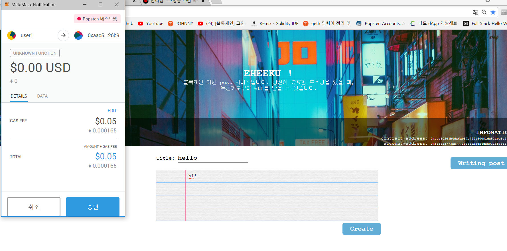
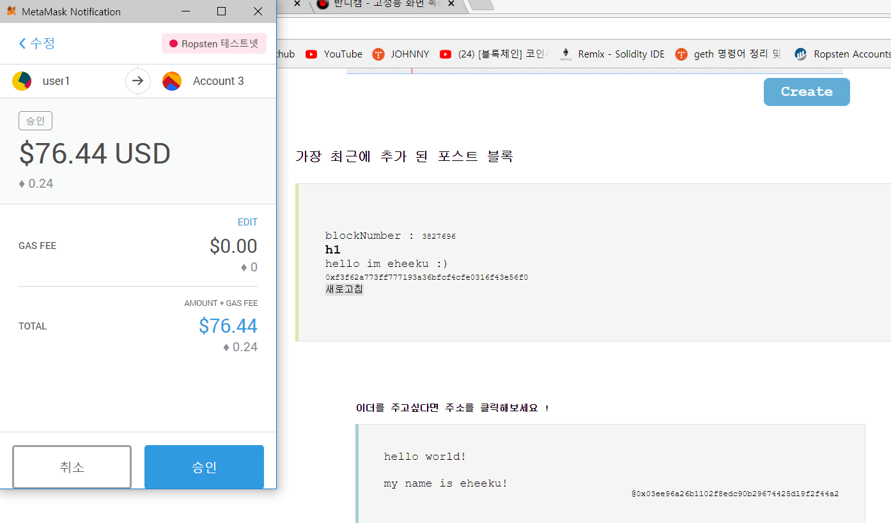

# 블록체인 기반 포스팅 서비스

### 목적
 포스팅을 통해 남들에게 기여하는 보상을 왜 받지 못할까? 라는 생각에서 프로젝트를 시작하게 되었습니다.


### what is this?
 포스팅 시 gas를 지불하고, 누군가에게 유효한 포스팅을 했을 경우 타인이 당신에게 이더를 줄 수 있는 서비스입니다.  
|  main| write form | create post |get eth|  
|:--------:|:--------:|:--------:|:--------:|  
|  |  |  |  |
> path : testimg  

### 사용법

1. GETH : create user
```
geth --rpc --rpccorsdomain "*" --nodiscover --datadir "chain-data" --port "30303" --rpcapi "db,eth,net,web3,
>> personal,admin,miner,debug,txpool" --networkid 1001012
```
2. metamask와 geth user 연동
3. node 실행
```
live-server
```
#### 즐기기
* 포스트를 작성합니다.
* 마음에 드는 포스트의 @ 뒤 주소를 클릭하면 이더를 보낼 수 있습니다.
#### bug
* 새로고침
